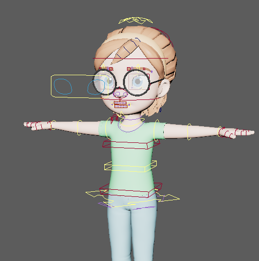
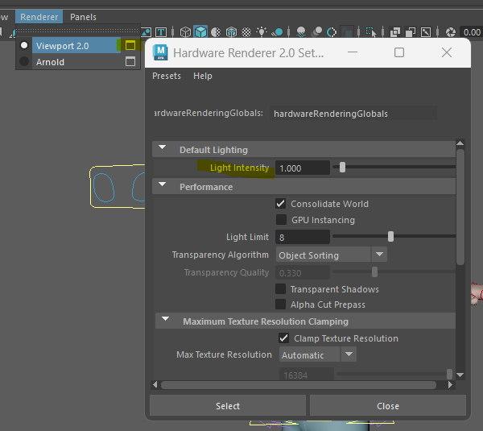
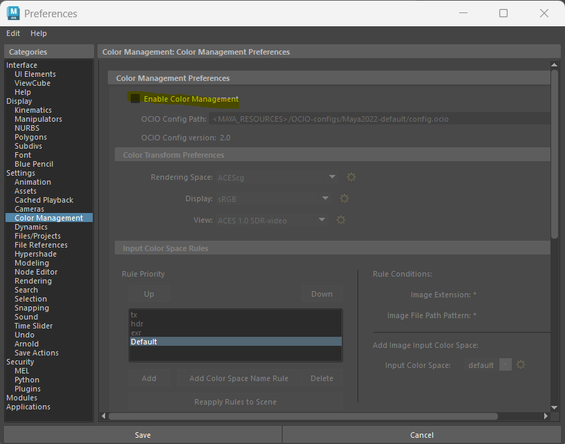

# 問題
Reference或import角色模型後，模型發光。

# 解決方法

### 1. Light intensity 調1

1. 3D視窗上方那行點Renderer
2. 點Viewport 2.0右邊的圖示
3. 打開Default Lighting
4. 將Light intensity調成1

### 2. 關掉color management

1. 點擊螢幕右下角的齒輪小黃人(Preference)
2. 在左邊那行列表找到Color Management
3. 在右側欄Color Management Preference裡
4. 將Enable Color Management勾勾取消

# 參考資料
[reddit_Color space appears different when I create reference of a character rig?](https://www.reddit.com/r/Maya/comments/174yp0h/color_space_appears_different_when_i_create/)

