# 簡介
## Arnold 
* 是Maya內建的寫實算圖引擎
* 含有 Ai 的材質球
* 一定要打光
* Ai Standard Surface 是Arnold的基礎標準材質

***
# Ai Standard Surface 設定介紹

## Base 基礎
1. Wigth 顏色強度
2. Color 顏色
3. Diffuse Roughness 粗糙度
4. Metalness 金屬感

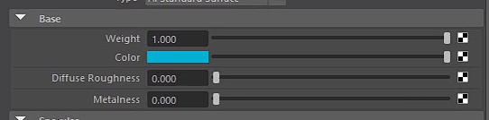

***

## Specular 鏡面反射
1. Wight 反射強度
2. Color 反射顏色
3. Roughness 反光粗糙度
4. IOR 折射率值
5. Anisotropy 反光旋轉方向
6. Rotation 反光角度

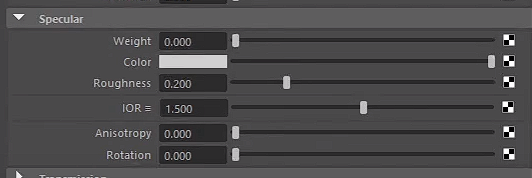

***

## Transmission 透明
1. Wight 透明程度
2. Color 透明顏色
3. Depth 物件穿透深度
4. Scatter 分散值
5. Scatter Anisotropy 光線散射
6. Dispersion Abbe 色散系数
（ 係數介於10-70 ）
7. Extra Roughness 霧面
8. Dielectric Priority 多重透明物體渲染方式

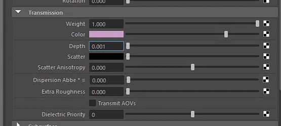

***

## Subsurface 透光
1. Wight 透光程度
2. Color 透光顏色
3. Radius 半徑 / 顏色
4. Scale 強度
5. Type 透光效果（ diffusion / randomwalk / randomwalk_v2 ）
6. Anisotropy 旋轉角度

* 用於皮膚效果

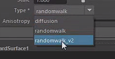

***

## Coat 外膜 / 二次反光
1. Wight 反光程度
2. Color 反光顏色 （會疊色
3. Roughness 模糊 / 粗糙程度
4. IOR 折射率
5. Anisotropy 方向性光澤（ 會被Roughness 影響
6. Rotation 反光方位走向
7. Normal （ 不用動 ）

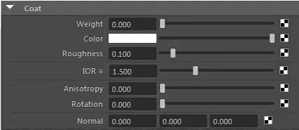
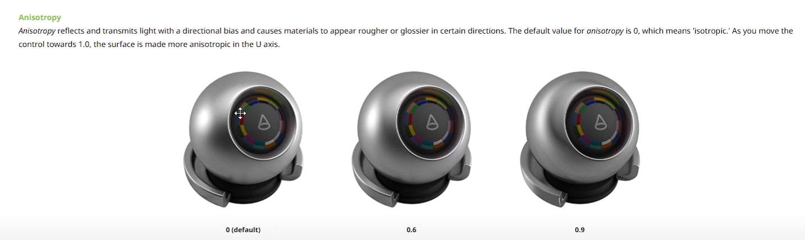
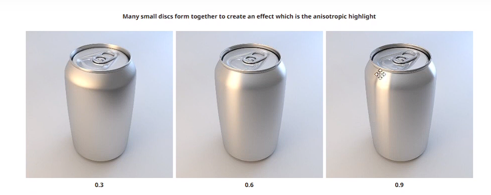

***

## sheen 光澤 / 邊光
1. Weight 邊光程度
2. Color 邊光顏色
3. Roughness  邊光粗糙度

* 絨毛效果/ 頂上邊光
* 適用於衣服材質

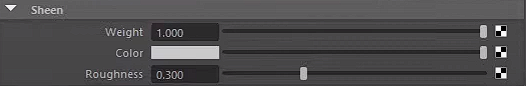

***

## Emission 發光
1. Weight 發光程度
2. Color 發光顏色

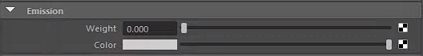

***

## Thin Film 薄膜反光
1. Thickness 厚度 ( 會改變色澤
2. IOR 折射率

* 需搭配其他反光或光感，才有作用
* 應用於高反光、複合式材質、甲蟲殼上、烤漆效果

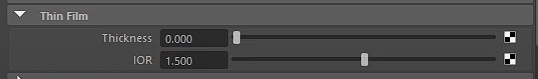
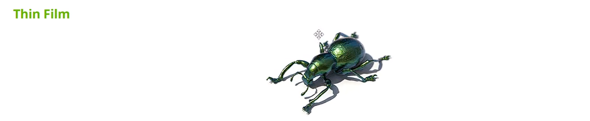
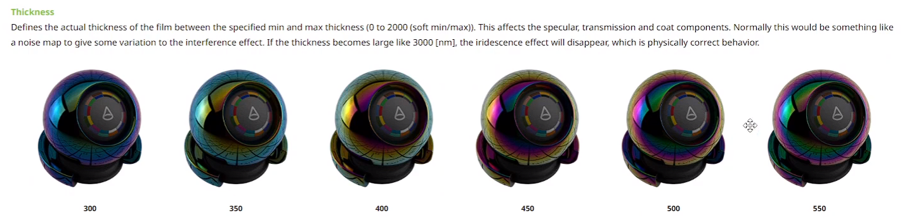

***

# 標準表面預設
* 可用於快速上材質

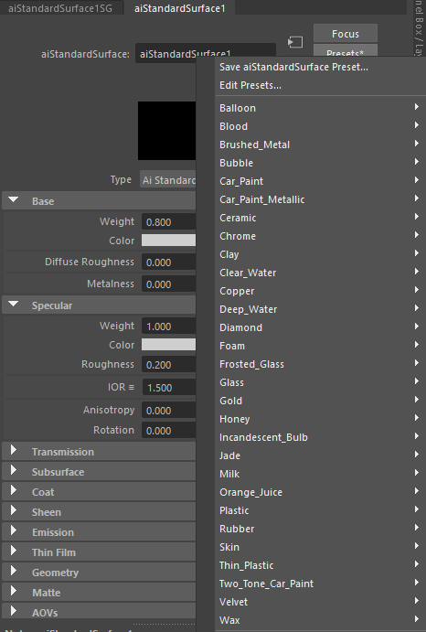

***

# 參考資料

* [Autodesk Standard Surface ](https://autodesk.github.io/standard-surface/)
* [Arnold User Guide](https://help.autodesk.com/view/ARNOL/CHS/?guid=arnold_user_guide_ac_surface_shaders_ac_standard_surface_html)
* [Standard Surface - Arnold for Maya](https://help.autodesk.com/view/MAYAUL/2024/CHS/?guid=arnold_for_maya_surface_am_Standard_Surface_html)

