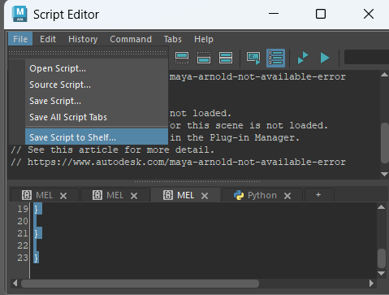

# 製作界面按鈕
1. 把程式碼貼在script Editor
2. 按ctrl A全選程式碼後，按圖中的按鈕，就能製成按鈕在上方界面

* 未來只要是這台電腦，按鈕都會存在且不會消失（除非你刪除

# 使用方法
* 先選 UV 好的模型, 然後再選一個或多個要貼上UV的模型.

# 下載連結

* Mel腳本  
[Maya 每日一招複製 模型 UV ( Copy polygon UV )](https://maya-tricks.blogspot.com/2010/05/uv-copy-polygon-uv.html?m=1)

