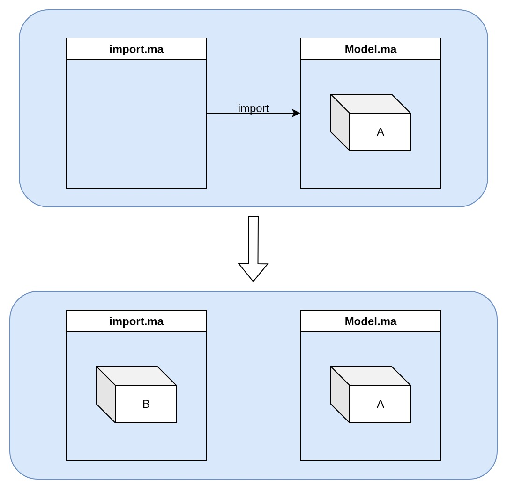
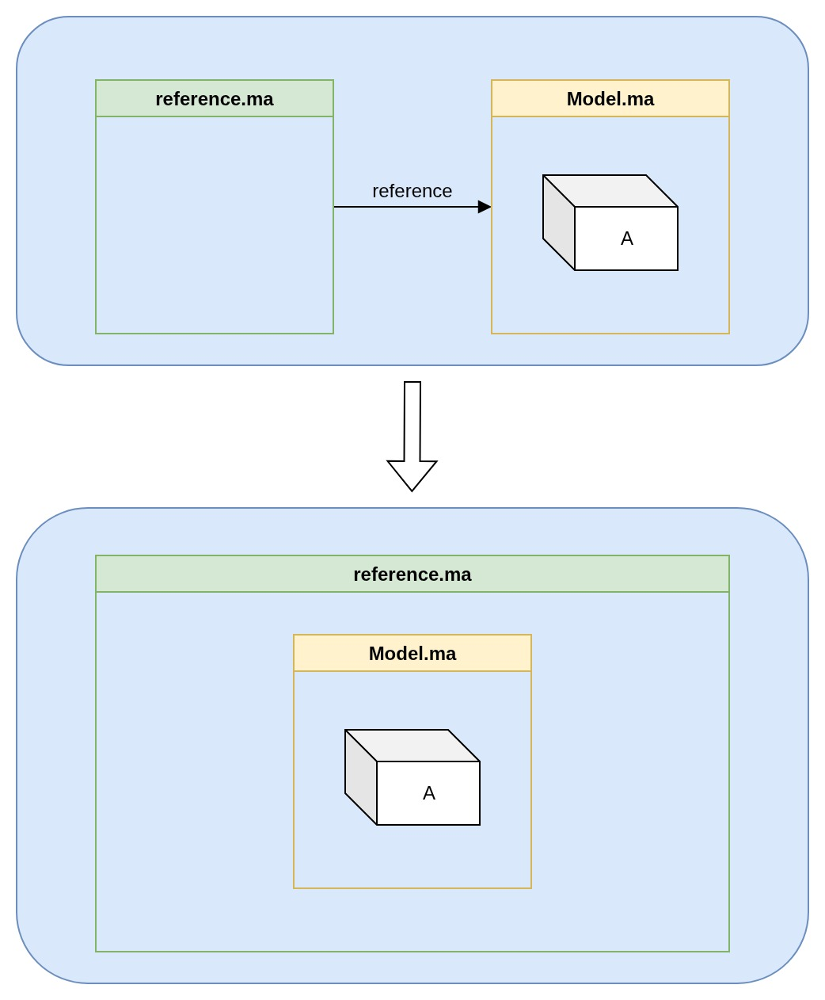

## MAYA 的匯入方式
1. import
2. reference

 

## import

import.ma讀取Model.ma的所有物件，並**生成**與Model.ma相同的所有物件進入檔案裡。 

* 兩個檔案的物件**無牽連**（各自獨立）
* 檔案大

 

## reference

reference.ma讀取Model.ma的所有物件，並**顯示**在reference.ma上。 

* 兩個檔案的物件**有牽連**（僅Model.ma的物件牽動reference.ma）
* 檔案小

