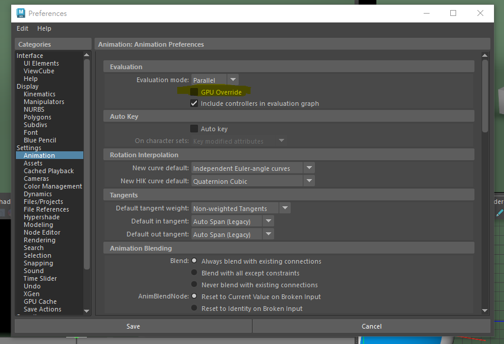

# 問題
Set key時，視窗的姿勢會變形。
但渲染時姿勢正常。

# 解決方法

### 關掉GPU Override
* Preferences > Animation > 關掉GPU Override 

# 參考資料

https://forums.autodesk.com/t5/maya-animation-and-rigging-forum/when-posing-my-model-becomes-distorted-in-the-viewport-but-looks/td-p/10808270?utm_source=perplexity

